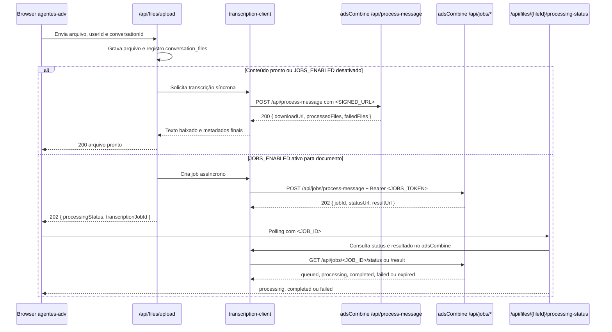
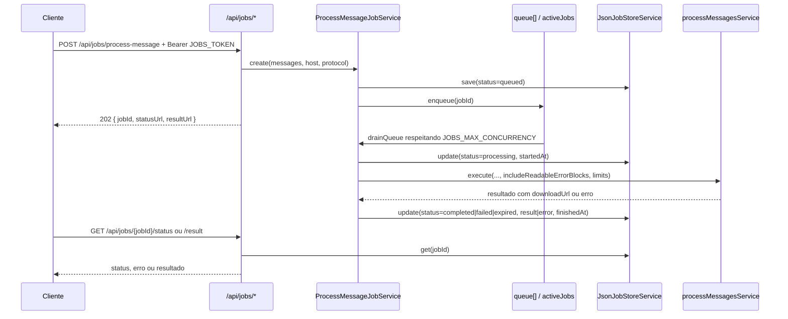
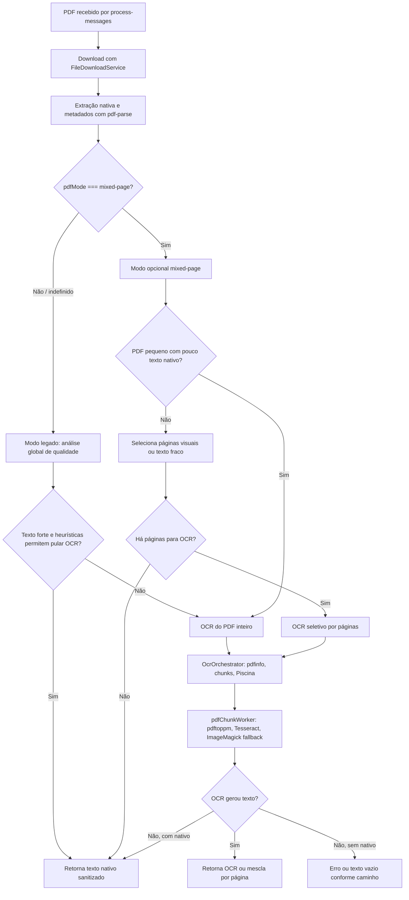
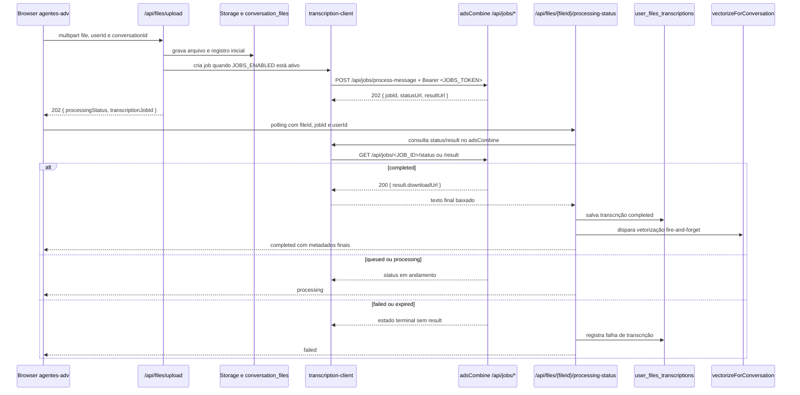

# Roadmap do Fluxo adsCombine e agentes-adv

Nota inicial: este documento é apenas documentação. Ele registra evidências da implementação atual para orientar próximos passos de mapeamento, sem alterar runtime, autenticação, fila, OCR, OpenAPI ou código de integração.

`API-TRANSCRIBE-README.md` e `DELETE-TEXTS-README.md` são documentos anteriores na raiz do adsCombine. Eles devem ser tratados como referência e dívida documental para consolidação futura, sem edição nesta tarefa.

## Estado Atual

Onde estamos: o adsCombine é o microserviço que recebe chamadas HTTP, processa mensagens e arquivos, extrai texto de PDFs, aciona OCR quando necessário, grava saídas em `/texts/{conversationId}` e expõe jobs assíncronos para `process-message`. O serviço combina rotas Express, controllers Zod, serviços de processamento, fila de jobs em memória, registros JSON locais em `temp/jobs` e workers Piscina para OCR de PDFs.

O runtime atual tem fronteiras importantes. Jobs são coordenados por `queue[]` e `activeJobs` no processo Node atual, com estado consultável em arquivos JSON. Esses registros sobrevivem enquanto o diretório local existir, mas não formam uma fila durável reconstruída automaticamente após restart. O pipeline PDF/OCR usa texto nativo quando a qualidade permite, pode cair para OCR, e oferece `mixed-page` como modo opcional, sem ser o padrão atual dos jobs.

No lado consumidor, o agentes-adv faz upload de arquivos, decide se usa jobs por `JOBS_ENABLED`, chama o adsCombine por cliente dedicado, persiste metadados e transcrições no seu próprio domínio, e mantém polling visual no browser até `processing`, `completed` ou `failed`. Assim, o estado atual já tem integração assíncrona funcional e documentada, mas ainda carrega riscos conhecidos em restart, cancelamento, OCR com rotação 90°, falso texto nativo, observabilidade granular e dívida de documentação pública.

Para onde queremos ir: manter este documento como mapa canônico do fluxo, com contratos, limites, decisões e roadmap verificáveis. Próximas mudanças funcionais devem nascer do roadmap abaixo, não ser descritas como entregas já concluídas.

## Fronteiras do Sistema

O adsCombine concentra responsabilidades de microserviço: autenticação das suas rotas, validação dos contratos HTTP, processamento de mensagens, download de arquivos via URL assinada recebida, extração PDF/OCR, geração de arquivos públicos em `/texts`, controle de jobs, retenção local de registros JSON e exposição de status/resultados. Ele não decide a experiência visual de upload do usuário final e não controla a flag `JOBS_ENABLED`.

O agentes-adv concentra responsabilidades de aplicação consumidora: autenticação e sessão do usuário final, upload para storage da conversa, criação de URLs assinadas temporárias, escolha entre fluxo legado e jobs por variáveis próprias, polling de processamento, persistência de transcrições e atualização do estado visual dos anexos. `JOBS_ENABLED`, `JOBS_API_BASE_URL`, `JOBS_LEGACY_FALLBACK_ENABLED` e os parâmetros de polling pertencem ao agentes-adv.

Contrato entre os dois: o agentes-adv envia placeholders equivalentes a `<SIGNED_URL>`, `<FILE_ID>`, `<USER_ID>` e `conversationId` para o adsCombine, usando `Authorization: Bearer <JOBS_TOKEN>` quando chama `/api/jobs/*`. O adsCombine responde com `jobId`, status, resultado e `downloadUrl`; o agentes-adv interpreta esses dados e decide como refletir o ciclo no banco, no storage e na UI. A rota legada pública `/api/process-message` continua documentada como risco de compatibilidade, sem mudar a fronteira nesta tarefa.

## Contratos de API

Os exemplos abaixo usam apenas placeholders. Eles refletem campos verificados em rotas, controllers, serviços e cliente, sem tokens reais, JWTs, chaves ou URLs assinadas reais.

### adsCombine, `GET /api/health`

Endpoint protegido pelo token principal (`TOKEN`) para checagem operacional do serviço e da dependência `pdfinfo` usada no pipeline PDF/OCR.

```http
GET /api/health HTTP/1.1
Host: <ADSCOMBINE_HOST>
```

```json
{
  "status": "OK",
  "timestamp": "2026-05-06T12:00:00.000Z",
  "dependencies": {
    "pdfinfo": {
      "available": true,
      "version": "<PDFINFO_VERSION>"
    }
  }
}
```

### adsCombine, fluxo assíncrono de jobs

As rotas sob `/api/jobs` exigem `Authorization: Bearer <JOBS_TOKEN>`. Sem header bearer, a resposta é `401` com `{"error":"Unauthorized"}`. Com bearer diferente de `JOBS_TOKEN`, a resposta é `403` com `{"error":"Forbidden"}`. Esse erro de autenticação não é cenário de fallback legado no agentes-adv.

Estados emitidos pelo adsCombine: `queued`, `processing`, `completed`, `failed`, `expired`.

#### Criar job, `POST /api/jobs/process-message`

```http
POST /api/jobs/process-message HTTP/1.1
Host: <ADSCOMBINE_HOST>
Authorization: Bearer <JOBS_TOKEN>
Content-Type: application/json

[
  {
    "conversationId": "upload-<FILE_ID>",
    "body": {
      "userId": "<USER_ID>",
      "files": [
        {
          "fileId": "<FILE_ID>",
          "url": "<SIGNED_URL>",
          "mimeType": "application/pdf",
          "fileName": "documento.pdf"
        }
      ]
    }
  }
]
```

Resposta `202 Accepted`:

```json
{
  "jobId": "<JOB_ID>",
  "status": "queued",
  "statusUrl": "https://<ADSCOMBINE_HOST>/api/jobs/<JOB_ID>/status",
  "resultUrl": "https://<ADSCOMBINE_HOST>/api/jobs/<JOB_ID>/result",
  "createdAt": "2026-05-06T12:00:00.000Z"
}
```

Body inválido retorna `400`:

```json
{
  "error": "Invalid request body",
  "details": [
    {
      "path": ["body", "files", 0, "url"],
      "message": "Invalid URL"
    }
  ]
}
```

Falha ao criar o job, como fila cheia ou serviço indisponível, retorna `503` com `{"error":"<ERROR_MESSAGE>"}`.

#### Consultar status, `GET /api/jobs/:jobId/status`

```http
GET /api/jobs/<JOB_ID>/status HTTP/1.1
Host: <ADSCOMBINE_HOST>
Authorization: Bearer <JOBS_TOKEN>
```

Resposta `200 OK`:

```json
{
  "jobId": "<JOB_ID>",
  "type": "process-message",
  "status": "processing",
  "createdAt": "2026-05-06T12:00:00.000Z",
  "updatedAt": "2026-05-06T12:00:05.000Z",
  "startedAt": "2026-05-06T12:00:01.000Z",
  "resultUrl": "https://<ADSCOMBINE_HOST>/api/jobs/<JOB_ID>/result"
}
```

Job ausente retorna `404`:

```json
{
  "error": "Job not found"
}
```

#### Consultar resultado antes da conclusão, `GET /api/jobs/:jobId/result`

```http
GET /api/jobs/<JOB_ID>/result HTTP/1.1
Host: <ADSCOMBINE_HOST>
Authorization: Bearer <JOBS_TOKEN>
```

Enquanto o job está `queued` ou `processing`, a resposta é `202 Accepted`:

```json
{
  "jobId": "<JOB_ID>",
  "status": "processing"
}
```

#### Consultar resultado concluído

Resposta `200 OK` quando `status` é `completed`:

```json
{
  "jobId": "<JOB_ID>",
  "status": "completed",
  "result": {
    "conversationId": "upload-<FILE_ID>",
    "processedFiles": ["<FILE_ID>"],
    "failedFiles": [],
    "filename": "upload-<FILE_ID>-1760000000000.txt",
    "downloadUrl": "https://<ADSCOMBINE_HOST>/texts/upload-<FILE_ID>/upload-<FILE_ID>-1760000000000.txt"
  }
}
```

Quando `status` é `failed` ou `expired`, o endpoint também responde `200 OK`, mas sem `result`. Ambos são estados terminais de erro operacional, não um sucesso de negócio.

Exemplo para `failed`:

```json
{
  "jobId": "<JOB_ID>",
  "status": "failed",
  "error": "<ERROR_MESSAGE>"
}
```

Exemplo para `expired`:

```json
{
  "jobId": "<JOB_ID>",
  "status": "expired",
  "error": "<ERROR_MESSAGE>"
}
```

### agentes-adv, `POST /api/files/upload`

O upload do agentes-adv é multipart e exige sessão da aplicação. O handler recebe `file`, `userId` e `conversationId`. O comportamento muda conforme o tipo do arquivo e a flag cliente `JOBS_ENABLED`.

```http
POST /api/files/upload HTTP/1.1
Host: <AGENTES_ADV_HOST>
Content-Type: multipart/form-data; boundary=<BOUNDARY>

--<BOUNDARY>
Content-Disposition: form-data; name="file"; filename="documento.pdf"
Content-Type: application/pdf

<FILE_BYTES>
--<BOUNDARY>
Content-Disposition: form-data; name="userId"

<USER_ID>
--<BOUNDARY>
Content-Disposition: form-data; name="conversationId"

<CONVERSATION_ID>
--<BOUNDARY>--
```

Quando o arquivo já fica pronto durante a requisição, como texto simples, áudio transcrito diretamente ou documento processado pelo fluxo legado, a resposta é `200 OK`:

```json
{
  "realId": "<FILE_ID>",
  "id": "<FILE_ID>",
  "previewUrl": "/api/files/content?file_path=<ENCODED_STORAGE_PATH>",
  "filename": "<FILE_ID>_1760000000000_documento.pdf",
  "originalFilename": "documento.pdf",
  "mimeType": "application/pdf",
  "fileSize": 123456,
  "filePath": "<TRANSCRIPTION_PATH>",
  "storagePath": "<CONVERSATION_ID>/<FILE_ID>_1760000000000_documento.pdf"
}
```

Quando `JOBS_ENABLED` está ativo no agentes-adv para documentos processados via jobs, a resposta é `202 Accepted` e indica processamento pendente:

```json
{
  "realId": "<FILE_ID>",
  "id": "<FILE_ID>",
  "previewUrl": "/api/files/content?file_path=<ENCODED_STORAGE_PATH>",
  "filename": "<FILE_ID>_1760000000000_documento.pdf",
  "originalFilename": "documento.pdf",
  "mimeType": "application/pdf",
  "fileSize": 123456,
  "filePath": "",
  "storagePath": "<CONVERSATION_ID>/<FILE_ID>_1760000000000_documento.pdf",
  "processingStatus": "processing",
  "transcriptionJobId": "<JOB_ID>"
}
```

O polling do agentes-adv tolera os seguintes status vindos do serviço de jobs: pendentes `queued`, `pending`, `processing`, `running`; sucesso `completed`, `succeeded`, `done`; falha `failed`, `error`, `cancelled`, `expired`. Fallback para o fluxo legado só ocorre quando jobs estão desabilitados no cliente ou quando a rota de jobs não é suportada, com status HTTP `404`, `405` ou `501` e fallback habilitado. Falhas de autenticação, como `401` ou `403`, não fazem fallback.

## Fluxo Síncrono

O fluxo síncrono legado usa `POST /api/process-message`. Essa rota é pública no middleware atual do adsCombine e responde diretamente com o resultado de `processMessagesService.execute`, sem criar job.



```http
POST /api/process-message HTTP/1.1
Host: <ADSCOMBINE_HOST>
Content-Type: application/json

[
  {
    "conversationId": "upload-<FILE_ID>",
    "body": {
      "userId": "<USER_ID>",
      "files": [
        {
          "fileId": "<FILE_ID>",
          "url": "<SIGNED_URL>",
          "mimeType": "application/pdf",
          "fileName": "documento.pdf"
        }
      ]
    }
  }
]
```

Resposta `200 OK`:

```json
{
  "conversationId": "upload-<FILE_ID>",
  "processedFiles": ["<FILE_ID>"],
  "failedFiles": [],
  "filename": "upload-<FILE_ID>-1760000000000.txt",
  "downloadUrl": "https://<ADSCOMBINE_HOST>/texts/upload-<FILE_ID>/upload-<FILE_ID>-1760000000000.txt"
}
```

Se algum arquivo falha, o endpoint ainda pode responder `200 OK` com o arquivo em `failedFiles`, conforme o retorno do serviço:

```json
{
  "conversationId": "upload-<FILE_ID>",
  "processedFiles": [],
  "failedFiles": [
    {
      "fileId": "<FILE_ID>",
      "error": "Unsupported file type: zip"
    }
  ],
  "filename": "upload-<FILE_ID>-1760000000000.txt",
  "downloadUrl": "https://<ADSCOMBINE_HOST>/texts/upload-<FILE_ID>/upload-<FILE_ID>-1760000000000.txt"
}
```

Validação inválida retorna `400` com erro Zod serializado pelo controller:

```json
{
  "error": "Invalid request body",
  "details": [
    {
      "path": [0, "conversationId"],
      "message": "Invalid input: expected string, received undefined"
    }
  ]
}
```

Observações de validação: o controller aceita um objeto único ou array, normaliza para array e exige `conversationId`; `body.files` é opcional, mas cada arquivo informado deve ter `fileId`, `url` válida e `mimeType`. Campos extras, como `userId` e `fileName`, são tolerados pelo schema e podem ser enviados pelo agentes-adv, mas não são usados para definir o formato mínimo do adsCombine.

## Fluxo Assíncrono de Jobs

O fluxo assíncrono de `process-message` é exposto em `/api/jobs/process-message` e protegido por `JOBS_TOKEN`. O controller valida o body com o mesmo schema do fluxo legado, cria um registro `process-message` via `ProcessMessageJobService`, retorna `202` com `jobId`, `statusUrl` e `resultUrl`, e deixa a execução real para a fila interna do serviço.



Semântica observada:

- `queue`: array em memória de `{ jobId }`; só existe no processo Node atual e é drenado por `drainQueue()`.
- `activeJobs`: contador em memória usado para limitar execuções simultâneas por `JOBS_MAX_CONCURRENCY`.
- `JsonJobStoreService`: persiste cada job como JSON em `temp/jobs/{jobId}.json`, com escrita em arquivo temporário seguida de `rename`, validação de UUID e leitura/listagem por arquivos `.json`.
- Registros JSON: guardam `id`, `type`, `status`, `request`, `host`, `protocol`, timestamps, `result` e `error`; são estado consultável e base para manutenção, não uma fila executável reconstruída.
- Status válidos: `queued`, `processing`, `completed`, `failed` e `expired`.
- Resultado: enquanto `queued` ou `processing`, `/result` responde `202`; em `failed` ou `expired`, responde `200` com erro; em `completed`, responde `200` com `result`, incluindo `downloadUrl` para `/texts/{conversationId}/{filename}`.

A fila de jobs é em memória com registros JSON persistidos; isso não equivale a uma fila durável reconstruída automaticamente após restart.

## Pipeline PDF/OCR

O pipeline PDF/OCR baixa PDFs, tenta extração de texto nativo e pode acionar OCR conforme regras do serviço. O modo `mixed-page` existe como opção em `ProcessPdfService`, mas não é o padrão atual dos jobs: no fluxo assíncrono, `process-message-job.service.ts` chama `processMessagesService` sem `pdfMode`, o que preserva o caminho padrão/legado.

Fluxo observado:

1. `process-messages.service.ts` identifica `mimeType` de PDF e chama `ProcessPdfService.execute` com limites opcionais de job (`maxFileBytes`, páginas máximas e orçamento de OCR), propagando `pdfMode` somente se recebido nas opções.
2. `ProcessPdfService` baixa o arquivo com `FileDownloadService` e executa extração nativa com `PdfTextExtractorService`.
3. `PdfTextExtractorService` usa `pdf-parse` para texto e páginas, além de metadados de imagens e tabelas; cada página ganha `embeddedImageCount`, `tableCount` e `hasVisualContent`.
4. A qualidade do texto extraído é analisada por `TextQualityAnalyzer`. No modo legado, documentos pequenos podem entrar em OCR por limiar global; documentos com texto forte podem pular OCR; documentos com indicadores de OCR/scan ainda podem passar por heurística de tamanho por página antes de decidir OCR ou fallback para texto nativo.
5. Se `mode: 'mixed-page'` for explicitamente solicitado, o serviço normaliza páginas, seleciona páginas com conteúdo visual ou texto fraco/corrompido, respeita limites de páginas/orçamento de OCR, e mescla texto nativo e OCR por ordem de página. PDFs pequenos com pouco texto nativo podem usar OCR direto do PDF inteiro.
6. Quando OCR é necessário, `OcrOrchestrator` grava um PDF temporário, valida estrutura e contagem de páginas com Poppler/`pdfinfo`, cria chunks de páginas com `OcrChunkManager` e envia chunks ao `pdfWorkerPool` (Piscina).
7. `pdfChunkWorker.js` rasteriza páginas com Poppler/`pdftoppm`, executa Tesseract em TSV, escolhe idioma (`PDF_OCR_LANG` ou preferência `por+eng`/`por`), reconstrói texto por confiança e tenta fallback graduado com ImageMagick (`magick`/`convert`) para deskew leve, normalização, resize e threshold quando disponível.
8. Os resultados de OCR voltam como texto simples no OCR de PDF inteiro ou como páginas estruturadas no OCR seletivo; se OCR falhar ou retornar vazio, `ProcessPdfService` pode usar o texto nativo como fallback quando ele existe.

Tabela de decisão documental:

| Entrada/Condição | Caminho atual | Resultado esperado |
| --- | --- | --- |
| Job assíncrono sem `pdfMode` | `ProcessMessageJobService` não força modo; `ProcessPdfService` recebe `mode` indefinido | Usa caminho padrão/legado, com decisões globais de qualidade e heurísticas de OCR. |
| `mode: 'mixed-page'` passado explicitamente | `ProcessPdfService.processMixedPagePdf` | OCR seletivo por página visual/fraca ou OCR direto para PDFs pequenos com pouco texto nativo. |
| PDF inválido para Poppler | `OcrOrchestrator` valida com `pdfinfo` antes de OCR | OCR é pulado/retorna vazio em vez de rasterizar estrutura inválida. |
| OCR necessário | `OcrChunkManager` cria chunks; Piscina executa `pdfChunkWorker.js` | `pdftoppm` rasteriza páginas; Tesseract extrai TSV; ImageMagick é fallback de pré-processamento se disponível. |
| OCR falha mas há texto nativo | `runOcrWithFallback` ou fallback de `mixed-page` | Retorna texto nativo sanitizado, aceitando que a qualidade pode continuar limitada. |



## Integração com agentes-adv

A fronteira da integração é direta: o agentes-adv consome o adsCombine, e o adsCombine processa transcrições, jobs e arquivos de saída. `JOBS_ENABLED` pertence ao agentes-adv, não ao adsCombine. Quando esse toggle fica ativo no consumidor, o agentes-adv usa o fluxo assíncrono de jobs exposto pelo adsCombine; quando fica inativo, o consumidor usa o endpoint legado síncrono configurado em `TRANSCRIPTION_SERVICE_URL`.



As variáveis evidenciadas no consumidor ficam em `agentes-adv/src/lib/env.ts` e `agentes-adv/src/lib/services/transcription-client.ts`: `JOBS_ENABLED`, `JOBS_API_BASE_URL`, `JOBS_TOKEN`, `JOBS_LEGACY_FALLBACK_ENABLED`, `JOBS_POLL_TIMEOUT_MS`, `JOBS_POLL_INITIAL_DELAY_MS`, `JOBS_POLL_MAX_DELAY_MS` e `JOBS_POLL_BACKOFF_FACTOR`. `JOBS_API_BASE_URL` pode ser resolvida a partir de `JOBS_API_BASE_URL`, `ADSCOMBINE_BASE_URL` ou `TRANSCRIPTION_JOBS_BASE_URL`. `JOBS_TOKEN` é enviado como bearer token para rotas de jobs, sem registrar valores reais neste documento. O fallback legado é controlado por `JOBS_LEGACY_FALLBACK_ENABLED`, com compatibilidade também via `TRANSCRIPTION_LEGACY_FALLBACK_ENABLED`.

Em `agentes-adv/src/lib/services/transcription-client.ts`, a criação de job envia o payload de mensagem para `/api/jobs/process-message`, consulta `/api/jobs/{jobId}/status`, busca `/api/jobs/{jobId}/result` quando o status indica sucesso e baixa o texto final a partir de `downloadUrl`. O payload inclui `conversationId` no formato `upload-{fileId}`, `userId` e o arquivo com `fileId`, URL assinada, MIME type e nome. O polling usa atraso inicial, timeout total, teto de atraso e fator de backoff configurados por `JOBS_POLL_INITIAL_DELAY_MS`, `JOBS_POLL_TIMEOUT_MS`, `JOBS_POLL_MAX_DELAY_MS` e `JOBS_POLL_BACKOFF_FACTOR`. O fallback legado só ocorre quando habilitado e quando a falha do job usa status HTTP `404`, `405` ou `501`; falhas de status de job permitido não são tratadas como fallback automático.

Na rota `agentes-adv/src/app/api/files/upload/route.ts`, o upload primeiro grava o arquivo no bucket de conversa e cria o registro em `conversation_files`. Para `text/plain`, áudio e fluxo legado síncrono, a resposta retorna o arquivo pronto com status HTTP `200` implícito depois de persistir a transcrição em `user_files_transcriptions`. Para documentos processados por jobs, quando `ENV.JOBS_ENABLED` está ativo no agentes-adv, a rota cria uma URL assinada temporária, inicia o job pelo cliente de transcrição e responde `202` com `processingStatus: 'processing'` e `transcriptionJobId`, além dos metadados do arquivo. A resposta não expõe tokens e não deve expor URLs assinadas reais.

Na rota `agentes-adv/src/app/api/files/[fileId]/processing-status/route.ts`, o browser consulta o processamento com `fileId`, `jobId` e `userId`. Se já existir uma transcrição `completed` para o arquivo, a rota responde `completed` de forma idempotente com o caminho salvo, sem baixar novamente o resultado do job. Se o job ainda estiver em andamento, responde `processing` com `processingStatus: 'processing'` e o `jobStatus` bruto. Se o job falhar, persiste `transcription_status: 'failed'`, atualiza `conversation_files.status` para `error` e responde `failed` com HTTP `502`. Quando o job conclui, a rota salva ou sobrescreve o arquivo de transcrição, recria o registro `completed`, responde com metadados finais e dispara `vectorizeForConversation` em modo fire and forget; sucesso da vetorização marca o arquivo como `processed`, falha marca como `error` e apenas registra warning.

No browser, `agentes-adv/src/lib/file-upload-service.ts` trata `processingStatus: 'processing'` com `transcriptionJobId` como upload aceito para processamento assíncrono, chama `onProcessing`, e aguarda `/files/{fileId}/processing-status` a cada `PROCESSING_POLL_INTERVAL_MS` até `PROCESSING_POLL_TIMEOUT_MS`, com timeout por chamada `PROCESSING_STATUS_TIMEOUT_MS`. O hook `agentes-adv/src/hooks/use-file-attachments.ts` coloca arquivos em staging, persiste o estado parcial durante o callback `onProcessing`, restaura arquivos pendentes quando a conversa volta, evita callbacks antigos com `mountedRef` e `restoredStorageKeyRef`, e impede polling duplicado por `realId` com `activePollingRef`.

O staging no localStorage usa a chave `agentes-adv:file-attachments:{userId}:{conversationId}`, implementada em `agentes-adv/src/lib/file-attachments-storage.ts`. Entradas sem `realId` ou sem `uploadData` não são persistidas. Entradas com mais de 24 horas são removidas. Entradas `processing` são normalizadas para `completed` quando `uploadData.processingStatus` é `completed`, para `error` quando `uploadData.processingStatus` é `failed`, e são descartadas após 12 minutos se ainda estiverem em processamento. Quando a normalização altera ou remove registros, o storage regrava a chave ou remove a chave se não sobrar arquivo válido.

A normalização de status entre adsCombine e agentes-adv fica agrupada assim no cliente de transcrição: `queued`, `pending`, `processing` e `running` significam `processing`; `completed`, `succeeded` e `done` significam `completed`; `failed`, `error`, `cancelled` e `expired` significam `failed`. Status desconhecido é tratado como falha. No contrato exposto ao browser, `ProcessingStatusResponse` usa apenas `processing`, `completed` e `failed`, enquanto o staging visual do hook usa `processing`, `completed` e `error` para representar o mesmo ciclo no estado local.

## Autenticação e Segurança

O middleware aplica regras diferentes para jobs, rotas públicas legadas e demais rotas protegidas. Este documento cita apenas nomes de variáveis de ambiente, nunca valores reais.

| Superfície | Autenticação observada | Variável | Observação de segurança |
| --- | --- | --- | --- |
| `/api/jobs/*` | Obrigatório `Authorization: Bearer <jobs-token>`; ausência retorna `401`, token incorreto retorna `403`. | `JOBS_TOKEN` | Token principal (`TOKEN`) é rejeitado nas rotas de jobs; cobre criação, status e resultado. |
| `/api/process-message` | Público por compatibilidade legado. | N/A | Risco de compatibilidade legado/público: processa mensagens sem bearer no middleware atual; documentar e monitorar sem propor remoção obrigatória nesta tarefa. |
| `/api/health` | Protegido pelo token principal, porque não está em `authorizedPaths` nem em `/api/jobs`. | `TOKEN` | Endpoint de saúde expõe status e dependência `pdfinfo`; exige bearer principal no middleware atual. |
| `/texts/*` | Público por prefixo autorizado. | N/A | Serve arquivos gerados em `public/texts`; `downloadUrl` dos jobs aponta para essa superfície pública. |
| `/api/transcribe` | Protegido pelo token principal. | `TOKEN` | Rota de integração/transcrição exige bearer principal e aceita upload de áudio via `multipart/form-data`. |
| `/api/delete-texts` | Protegido pelo token principal. | `TOKEN` | Operação destrutiva de textos; exige bearer principal. |
| `/api-docs` e `/favicon.ico` | Públicos por prefixo autorizado. | N/A | Documentação Swagger fica pública no middleware atual. |

Variáveis relevantes para operação e segurança, sem valores: `JOBS_TOKEN`, `JOBS_MAX_CONCURRENCY`, `JOBS_MAX_QUEUE_SIZE`, `JOB_STALE_AFTER_MS`, `JOBS_RETENTION_HOURS`.

## Armazenamento, Retenção e Restart

Os jobs usam armazenamento local em `temp/jobs`, definido por `JOBS_DIR`, com um arquivo JSON por `jobId`. O store cria o diretório se necessário, grava com arquivo temporário e `rename`, lista apenas arquivos `.json` cujo nome é UUID válido, ignora arquivos ilegíveis com log de warning e rejeita IDs inválidos para reduzir risco de path traversal.

A manutenção roda na construção do `ProcessMessageJobService` e depois a cada `60_000ms` por `setInterval(...).unref()`. A cada ciclo, `expireStaleJobs(JOB_STALE_AFTER_MS)` marca jobs `queued` ou `processing` como `expired` quando o tempo desde `startedAt`, `updatedAt` ou `createdAt` passa do limite; em seguida, `deleteFinishedOlderThan(JOBS_RETENTION_HOURS * 60 * 60 * 1000)` remove JSONs finalizados (`completed`, `failed`, `expired`) mais antigos que a retenção.

Durante o drain da fila, `pruneExpiredQueuedJobs()` também remove da fila em memória jobs ainda `queued` cujo `createdAt` ultrapassou `JOB_STALE_AFTER_MS`, marcando o registro como `expired`. Jobs em execução são limitados por `runWithJobTimeout()`, que usa `JOB_STALE_AFTER_MS` como timeout e marca como `expired` quando a mensagem indica estouro de tempo; outros erros viram `failed`.

Restart: os registros JSON sobrevivem enquanto o diretório local existir, mas `queue` e `activeJobs` não sobrevivem ao processo. Após restart, o serviço consegue consultar registros persistidos e a manutenção pode expirar jobs antigos `queued`/`processing`, porém não há reconstrução automática da fila nem reexecução garantida de jobs que estavam pendentes ou em processamento antes da parada. Portanto, os JSONs devem ser tratados como registro de estado/consulta/retenção, não como fila durável.

## Decisões Recentes

### O que fizemos e por quê

Consolidamos este arquivo como documento canônico do fluxo adsCombine e agentes-adv porque os contratos estavam espalhados entre código, testes, READMEs raiz e evidências de tarefas. O objetivo é responder, em um único lugar, o que foi observado, por que as decisões existem, onde estão os limites atuais e quais riscos ainda precisam de trabalho futuro.

Preservamos `API-TRANSCRIBE-README.md` e `DELETE-TEXTS-README.md` como documentação anterior, sem edição nesta tarefa. A razão é evitar misturar consolidação documental com mudança de escopo em documentos raiz legados; a dívida fica explícita no roadmap para revisão própria.

Registramos a matriz de autenticação porque as superfícies têm riscos diferentes. `/api/jobs/*` exige `JOBS_TOKEN`, `/api/health`, `/api/transcribe` e `/api/delete-texts` seguem o token principal, `/texts/*` é público por servir saídas, e `/api/process-message` segue público por compatibilidade legado. Esse último ponto permanece uma declaração de risco, não uma recomendação automática de quebra de compatibilidade.

Documentamos a semântica de armazenamento dos jobs para evitar uma interpretação perigosa: os arquivos JSON em `temp/jobs` são registros consultáveis e base de retenção, enquanto a fila executável fica em memória. Por isso, a frase operacional permanece: A fila de jobs é em memória com registros JSON persistidos; isso não equivale a uma fila durável reconstruída automaticamente após restart.

Também registramos a decisão do commit `bc9e71a` (`fix(jobs): remove hardcoded mixed-page pdfMode to enable fast-path OCR`). O commit removeu `pdfMode: 'mixed-page'` da criação de jobs em `ProcessMessageJobService`, e o teste `test/jobs/process-message-job-service.test.ts` fixa que `options?.pdfMode` fica indefinido quando jobs chamam o processador. O motivo foi restaurar o caminho padrão/legado e evitar custo obrigatório do modo opcional `mixed-page` em todo job de PDF. Essa decisão não implementou correção de orientação de OCR e não resolve documentos escaneados com conteúdo rotacionado 90° dentro da página.

Onde estamos: há contratos, diagramas, limites de autenticação, ciclo de jobs, pipeline PDF/OCR, integração com agentes-adv, limitações e runbook em um documento único. Para onde queremos ir: transformar os riscos abaixo em histórias ou tarefas separadas, com aceitação clara e verificação própria, sem tratar itens de roadmap como entrega atual.

## Limitações Conhecidas

- A fila de jobs não deve ser apresentada como durável.
- O modo `mixed-page` deve ser descrito como opcional até haver evidência de uso como padrão em jobs.
- `JOBS_ENABLED` deve permanecer descrito como configuração do agentes-adv.
- PDFs digitalizados rotacionados continuam problemáticos: uma classe conhecida é PDF A4 portrait com `/Rotate 0`, mas com o conteúdo escaneado com rotação 90° dentro da própria página. Nesse caso, a orientação do dicionário de página não denuncia o problema e o OCR pode ler pouco ou nada.
- PDFs com falso texto nativo podem enganar heurísticas: alguns documentos contêm majoritariamente textos de validação, links, selos ou metadados, enquanto o conteúdo jurídico/negocial relevante está em imagem escaneada. O pipeline pode tratar esse texto nativo como fallback, mas isso não equivale a extração completa do documento.
- O timeout usa `Promise.race` em jobs, processamento de arquivos e OCR. Isso marca timeout para o chamador, mas não cancela necessariamente trabalho já iniciado no processor, no Poppler, no Tesseract ou nos workers Piscina.
- Há coordenação em duas camadas de fila/paralelismo: jobs usam fila em memória própria, enquanto OCR usa Piscina com chunks de páginas. Essa combinação ajuda throughput, mas também cria disputa de CPU e trabalho residual quando há timeout não cancelante.
- ImageMagick aplica `deskew` leve e pré-processamento de contraste/threshold quando disponível, mas não há correção geral implementada para conteúdo escaneado girado 90°. Não se deve afirmar que orientação automática de 90° já está resolvida.

## Runbook Operacional

- Job parado em `queued` ou `processing`: consultar `/api/jobs/{jobId}/status` com `JOBS_TOKEN`, comparar `createdAt`/`startedAt`/`updatedAt` com `JOB_STALE_AFTER_MS` e aguardar o próximo ciclo de manutenção de 60s antes de classificar como expirado.
- Job `expired`: verificar se a causa foi timeout de execução, expiração em fila ou manutenção por stale; conferir `error` no status/resultado e orientar reenvio quando apropriado.
- Token inválido: para `/api/jobs/*`, ausência de bearer indica `401` e bearer diferente de `JOBS_TOKEN` indica `403`; para rotas protegidas fora de jobs, validar uso do token principal (`TOKEN`) sem registrar valores.
- Saturação de fila: criação de job pode retornar `503` com mensagem de fila cheia quando `queue.length >= JOBS_MAX_QUEUE_SIZE`; reduzir chegada de requisições, aguardar drenagem ou ajustar capacidade por configuração em ambiente apropriado.
- Restart: após reinício, não assumir retomada automática de jobs; consultar registros JSON, deixar manutenção expirar `queued`/`processing` antigos e solicitar novo job quando a execução anterior não tiver resultado concluído.
- Verificação de limpeza: conferir que jobs finalizados antigos (`completed`, `failed`, `expired`) saem do store depois de `JOBS_RETENTION_HOURS`; se arquivos permanecerem, revisar logs de `Job maintenance failed` e permissões do diretório `temp/jobs`.

## Roadmap

Este roadmap é direção futura. Ele não declara implementação atual, não altera contratos existentes e não deve ser lido como entrega desta tarefa.

| Item | Prioridade | Risco endereçado | Impacto esperado | Critérios de aceitação |
| --- | --- | --- | --- | --- |
| Rotated scans, rotação 90° | Alta | PDFs A4 portrait com `/Rotate 0`, mas conteúdo escaneado girado dentro da página, podem gerar OCR vazio ou incompleto. | Melhor recuperação de documentos digitalizados que hoje parecem válidos, mas têm texto principal ilegível para Tesseract. | Testes com PDFs sintéticos ou fixtures reais anonimizadas cobrindo conteúdo rotacionado 90°; documentação afirma claramente quando a correção está ativa; métricas mostram extração útil antes/depois; fallback não degrada PDFs já legíveis. |
| False-native-text detection, falso texto nativo | Alta | Textos nativos de validação, links, selos ou metadados podem mascarar conteúdo jurídico/negocial que está apenas em imagem. | Decisão mais segura entre texto nativo, OCR e `mixed-page`, reduzindo retornos incompletos que parecem sucesso. | Heurística ou classificador documentado; testes com PDFs cujo texto nativo é irrelevante; aceitação exige detectar falso positivo e acionar OCR ou sinalizar baixa confiança; exemplos mantêm placeholders e não expõem dados reais. |
| Worker cancellation/timeout semantics | Alta | `Promise.race` marca timeout para o chamador, mas pode deixar processor, Poppler, Tesseract ou workers Piscina trabalhando. | Menos CPU residual, menos contenção entre jobs, status mais fiel para usuários e operação. | Semântica de cancelamento definida para job, arquivo, chunk e worker; testes simulam timeout e confirmam encerramento ou isolamento do trabalho residual; logs indicam motivo do cancelamento; comportamento de `expired` continua compatível. |
| Restart/job recovery semantics | Média | JSONs persistidos podem ser confundidos com fila durável, mas `queue[]` e `activeJobs` somem no restart. | Operação mais previsível após deploy, crash ou reinício, com política clara de expirar, reprocessar ou recriar jobs. | Decisão arquitetural documentada, como expirar pendentes ou reconstruir fila; testes cobrem restart com jobs `queued` e `processing`; runbook atualizado; nenhuma claim chama o JSON store de fila durável sem implementação correspondente. |
| Observability by job/page | Média | Falhas por job, arquivo, página ou chunk ficam difíceis de diagnosticar quando há OCR seletivo, Piscina e fallback. | Debug mais rápido, melhor capacidade de auditoria e base para priorizar melhorias de OCR. | Logs estruturados por `jobId`, `fileId`, página e chunk; métricas de duração, tentativas, confiança OCR e fallback; exemplos sem tokens reais; painel ou consulta operacional definida para status por job/página. |
| Security/OpenAPI/docs debt | Média | `/api/process-message` público, Swagger público, READMEs raiz anteriores e contratos OpenAPI podem divergir do documento canônico. | Menos risco de integração incorreta, melhor revisão de segurança e documentação mais consistente para consumidores. | Revisão específica decide destino de endpoint legado público sem quebra acidental; OpenAPI e documento canônico passam por check automático de consistência; `API-TRANSCRIBE-README.md` e `DELETE-TEXTS-README.md` são consolidados ou marcados formalmente como históricos; assertions bloqueiam segredos e URLs reais. |

## Glossário

- adsCombine: microserviço responsável por processamento, transcrição, jobs, PDF/OCR e arquivos de texto servidos em `/texts`.
- agentes-adv: aplicação consumidora que faz upload, controla sessão, decide uso de jobs por configuração própria, persiste transcrições e mostra status ao usuário.
- Job: execução assíncrona criada em `/api/jobs/process-message`, identificada por `<JOB_ID>`, coordenada em memória e registrada em JSON para consulta e retenção.
- Worker: processo ou thread de trabalho usado para executar partes pesadas do OCR, como chunks de páginas no `pdfChunkWorker.js` via Piscina.
- OCR, Optical Character Recognition: reconhecimento óptico de caracteres aplicado a PDFs ou páginas quando a extração de texto nativo não é suficiente.
- PDF pipeline: sequência de download, validação, extração nativa, análise de qualidade, decisão de OCR, processamento por chunks e retorno de texto ou fallback.
- Polling: consultas repetidas feitas pelo agentes-adv para acompanhar `/api/jobs/<JOB_ID>/status`, `/api/jobs/<JOB_ID>/result` ou `/api/files/{fileId}/processing-status` até um estado final.
- Fallback: caminho alternativo usado quando o caminho principal não resolve. Exemplos: usar texto nativo se OCR falhar, ou usar endpoint legado quando jobs estão desabilitados ou não suportados com fallback habilitado.
- Token: segredo de autenticação enviado como bearer em rotas protegidas. Este documento usa placeholders como `<JOBS_TOKEN>` e nunca registra valores reais.
- Legacy endpoint, endpoint legado: rota mantida por compatibilidade. Aqui, `/api/process-message` é o endpoint legado síncrono e público no middleware atual, com risco de segurança documentado.
- JSON store: conjunto de arquivos `temp/jobs/{jobId}.json` que registra estado, timestamps, resultado e erro dos jobs. É armazenamento de estado, não fila durável por si só.
- Piscina: biblioteca usada para pool de workers Node, aqui aplicada ao OCR de chunks de PDF para paralelizar trabalho pesado.
- `mixed-page`: modo opcional de processamento PDF que mistura texto nativo e OCR seletivo por página. Não é o padrão atual dos jobs.
- `JOBS_ENABLED`: flag do agentes-adv que decide se o consumidor usa jobs assíncronos do adsCombine para documentos aplicáveis.
- `downloadUrl`: URL retornada pelo adsCombine para buscar o texto final em `/texts/{conversationId}/{filename}`. Exemplos devem usar host placeholder, nunca URL real assinada.

## Índice de Evidências

Base do adsCombine: `/home/suegoidkun/Documentos/Trampo/CofounderAI/adsCombine`.

- `src/api/server.ts`: inicializa o servidor Express, aplica CORS, JSON body limit, logs HTTP, middlewares globais, Swagger, rotas principais e verificação de disponibilidade do `pdfinfo` no startup.
- `src/api/routes/index.ts`: agrega rotas públicas e protegidas, incluindo `/texts`, `/api/jobs`, rotas de processamento e transcrição, além do health check com status do `pdfinfo`.
- `src/api/controllers/messages.controllers.ts`: valida o payload do endpoint legado de processamento com Zod, chama `processMessagesService` e mantém o fluxo de `/process-message`; também valida e executa `/delete-texts`.
- `src/api/controllers/jobs.controllers.ts`: cria jobs assíncronos de `process-message`, expõe status e resultado por `jobId`, valida UUID de parâmetros e diferencia respostas para jobs em andamento, concluídos, falhos, expirados ou ausentes.
- `src/core/services/jobs/process-message-job.service.ts`: mantém uma fila em memória para execução de jobs, grava registros no store JSON, aplica limites de concorrência, timeout, manutenção de expiração e retenção, e chama `processMessagesService` com blocos de erro legíveis e limites configurados.
- `src/core/services/jobs/json-job-store.service.ts`: persiste registros de job em arquivos JSON locais com escrita via arquivo temporário e rename, valida UUID para evitar path traversal, lista jobs, expira jobs antigos e remove jobs finalizados fora da retenção; isso não deve ser tratado como fila durável.
- `src/core/services/jobs/job.types.ts`: define os estados de job, o formato do resultado de `process-message`, o registro persistido e o input necessário para criação de jobs.
- `src/core/services/messages/process-messages.service.ts`: processa arquivos por mensagem com controle de concorrência, roteia por MIME type, aplica limites opcionais para jobs, gera blocos de erro legíveis quando configurado e salva o texto final em `/texts/{conversationId}`.
- `src/core/services/messages/pdf-utils/process-pdf.service.ts`: baixa PDFs, extrai texto nativo, avalia qualidade, decide OCR no modo legado, oferece modo opcional `mixed-page` para OCR seletivo por página e aplica limites de páginas e orçamento de OCR quando recebidos.
- `src/core/services/messages/pdf-utils/ocr-orchestrator.service.ts`: valida PDFs com `pdfinfo`, divide páginas em chunks, executa OCR em paralelo via worker pool, suporta OCR do PDF inteiro ou páginas selecionadas e faz limpeza de arquivos temporários.
- `src/core/services/messages/pdfChunkWorker.js`: rasteriza páginas com Poppler, executa Tesseract com tentativas graduais de pré-processamento, controla threads internas do OCR, escolhe idioma e retorna texto simples ou resultados estruturados por página.
- `src/config/env.ts`: valida variáveis de ambiente com Zod, incluindo tokens, limites de jobs, limites de extração, limites de OCR e parâmetros usados pelo processamento misto de páginas.
- `test/api/jobs-auth.test.ts`: verifica que rotas `/api/jobs` exigem `JOBS_TOKEN`, rejeitam o token principal e preservam a rota legada `/api/process-message` como pública.
- `test/jobs/process-message-job-service.test.ts`: cobre o serviço de jobs com store e processor falsos, confirmando que jobs usam o modo padrão de PDF porque `pdfMode` fica indefinido.
- `test/jobs/json-job-store.test.ts`: cobre persistência JSON de jobs, atualização de resultado com `downloadUrl`, rejeição de IDs inválidos, erro tipado para job ausente, expiração de jobs antigos e remoção por retenção.
- `test/pdf/process-pdf-mixed.test.ts`: cobre o modo opcional `mixed-page`, incluindo preservação de texto nativo forte, mescla em ordem de páginas, OCR direto para PDFs pequenos sem texto nativo, OCR em página visual e limite máximo de páginas.

Base do agentes-adv: `/home/suegoidkun/Documentos/Trampo/CofounderAI/agentes-adv`.

- `/home/suegoidkun/Documentos/Trampo/CofounderAI/agentes-adv/src/lib/services/transcription-client.ts`: integra o app com o microserviço de transcrição, criando jobs em `/api/jobs/process-message`, consultando status e resultado, baixando o texto por `downloadUrl`, usando `JOBS_ENABLED` no lado do agentes-adv e mantendo fallback legado configurável.
- `/home/suegoidkun/Documentos/Trampo/CofounderAI/agentes-adv/src/lib/env.ts`: define as flags do consumidor para jobs do adsCombine, incluindo `JOBS_ENABLED`, `JOBS_API_BASE_URL`, `JOBS_TOKEN`, `JOBS_LEGACY_FALLBACK_ENABLED` e parâmetros de polling/backoff.
- `/home/suegoidkun/Documentos/Trampo/CofounderAI/agentes-adv/src/app/api/files/upload/route.ts`: faz upload para storage, cria registro de arquivo, retorna `200` para conteúdo pronto ou `202` com `processingStatus` e `transcriptionJobId` quando inicia job assíncrono, e dispara vetorização fire and forget nos fluxos síncronos já persistidos.
- `/home/suegoidkun/Documentos/Trampo/CofounderAI/agentes-adv/src/app/api/files/[fileId]/processing-status/route.ts`: consulta job, normaliza resposta para `processing`, `completed` ou `failed`, persiste transcrição de forma idempotente, registra falhas e dispara vetorização fire and forget após conclusão.
- `/home/suegoidkun/Documentos/Trampo/CofounderAI/agentes-adv/src/lib/file-upload-service.ts`: detecta respostas `processing`, chama polling de `/files/{fileId}/processing-status`, aplica timeout total de processamento e timeout por consulta.
- `/home/suegoidkun/Documentos/Trampo/CofounderAI/agentes-adv/src/hooks/use-file-attachments.ts`: controla staging visual do upload, persiste arquivos aceitos para processamento, restaura polling pendente e protege callbacks antigos com refs de montagem, chave restaurada e conjunto de polling ativo.
- `/home/suegoidkun/Documentos/Trampo/CofounderAI/agentes-adv/src/lib/file-attachments-storage.ts`: persiste staging em `agentes-adv:file-attachments:{userId}:{conversationId}`, remove registros antigos, descarta processamento stale após 12 minutos e normaliza `processingStatus` para estado visual local.
- `/home/suegoidkun/Documentos/Trampo/CofounderAI/agentes-adv/src/types/files.ts`: define `FileDetails`, `ProcessingStatusResponse` e `StagingFile`, mostrando a diferença entre status de contrato (`processing`, `completed`, `failed`) e status visual local (`processing`, `completed`, `error`).

Notas de escopo preservadas da Task 1:

- Este índice descreve a implementação observada nos arquivos acima, sem propor alteração funcional.
- `JOBS_ENABLED` pertence ao cliente em agentes-adv, não ao serviço adsCombine.
- O modo `mixed-page` existe como opção de processamento de PDF, mas não é afirmado aqui como padrão atual dos jobs.
- Valores reais de tokens e URLs assinadas não devem aparecer neste documento.
