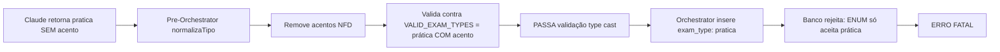
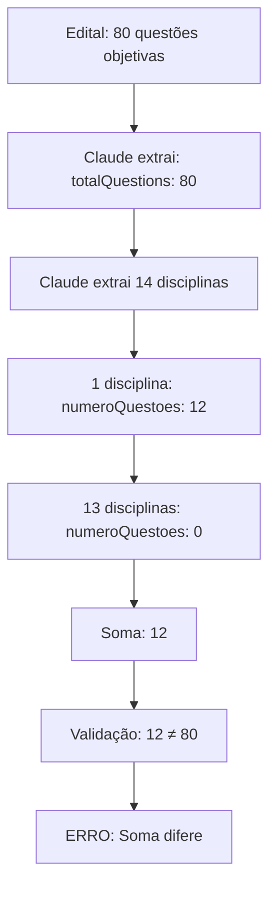

# 🔬 Relatório de Diagnóstico Detalhado - Processamento de Edital OAB 44º

**Data**: 20 de outubro de 2025, 00:38  
**Job ID**: `3a2a3758-824a-4f48-b4bd-6300addde2c0`  
**Edital**: 44º Exame de Ordem Unificado  
**Status**: ❌ FALHOU - Orchestrator bloqueado por erro no banco

---

## 📊 SUMÁRIO EXECUTIVO

O processamento falhou em **2 etapas críticas**:

1. **Erro fatal no Orchestrator** (00:38:08): Banco rejeitou `exam_type: "pratica"` (sem acento)
2. **Validação schema** (00:38:05): Soma de questões = 12 (esperado: 80)

**Impacto**: 
- ❌ Study plan **NÃO** foi criado
- ❌ Disciplinas **NÃO** foram inseridas
- ✅ JSON extraído e salvo no Supabase Storage
- ⚠️ Question Fixer **NÃO** foi executado (orchestrator falhou antes)

---

## 🔍 FASE 1: ANÁLISE DE ROOT CAUSES

### **ROOT CAUSE #1: Conflito de Acentuação "prática" vs "pratica"**

#### **Cadeia de Falhas**:



#### **Evidências**:

**1. Banco de Dados - ENUM Definitivo** ✅ CORRETO
```sql
SELECT unnest(enum_range(NULL::exam_type));
-- Resultado:
-- "objetiva"
-- "discursiva"
-- "prática"     ← COM ACENTO
-- "oral"
```

**2. Claude Extraction - Prompt Instrui SEM Acento** ❌ INCORRETO
```typescript
// edital-process.service.ts linha 772
"tipo": "objetiva|discursiva|pratica|oral|titulos|aptidao_fisica"
                              ^^^^^^^ SEM ACENTO
```

**3. Pre-Orchestrator - Normalização Agressiva** ❌ INCORRETO
```typescript
// pre-orchestrator-refactored.ts linha 297-301
function normalizeTipo(tipo: string): string {
  return tipo
    .toLowerCase()
    .normalize('NFD')
    .replace(/[\u0300-\u036f]/g, '') // ← REMOVE TODOS OS ACENTOS!
    .trim();
}
// Resultado: "prática" → "pratica"
```

**4. Validação TypeScript - Passa mas não deveria**
```typescript
// pre-orchestrator-refactored.ts linha 72
const VALID_EXAM_TYPES = ['objetiva', 'discursiva', 'prática', 'oral'] as const;
                                                      ^^^^^^^^ COM ACENTO

// Linha 222
if (!VALID_EXAM_TYPES.includes(tipoNormalizado as any)) {
  // "pratica" NÃO está na lista mas type cast força inclusão
}

// Linha 234
examType: tipoNormalizado as 'objetiva' | 'discursiva' | 'prática' | 'oral',
// Type assertion força TypeScript aceitar "pratica" como "prática"
```

**5. Supabase Rejeição Final**
```log
error: Agent Error invalid input value for enum exam_type: "pratica"
{"exam_type":"pratica","plan_id":"9d392aef-3e53-4fb4-a715-2563abd3cfb3"}
```

#### **Por que isso aconteceu?**

**Decisão Arquitetural Conflitante**:
- **Prompt para Claude**: Pede "pratica" SEM acento (linha 772 - edital-process.service.ts)
- **Código TypeScript**: Define "prática" COM acento (linha 72 - pre-orchestrator-refactored.ts)
- **Banco PostgreSQL**: ENUM com "prática" COM acento (definição da tabela)

**Função `normalizeTipo()` foi criada para**:
- Remover variações (PRÁTICA, Prática, prática → pratica)
- Permitir Claude retornar qualquer formato
- **MAS**: Não há mapeamento de "pratica" → "prática" antes do insert no banco

#### **Impacto em Cascata**:

| Componente | Recebe | Processa | Envia | Status |
|------------|--------|----------|-------|--------|
| Claude | Prompt: "pratica" | JSON: "pratica" | "pratica" | ✅ Obedeceu |
| Pre-Orchestrator | "pratica" | Remove acentos | "pratica" | ⚠️ Normaliza mas não remapeia |
| Type System | "pratica" | Type cast force | "pratica" | ❌ Aceita inválido |
| Orchestrator | "pratica" | INSERT SQL | "pratica" | ❌ Tenta inserir |
| PostgreSQL ENUM | "pratica" | Valida contra ENUM | **REJECT** | ❌ Valor não existe |

---

### **ROOT CAUSE #2: Soma de Questões Incorreta (12 vs 80)**

#### **Cadeia de Dados**:



#### **Evidências do JSON Extraído**:

**Distribuição Real no JSON**:
```json
{
  "concursos": [{
    "metadata": { "totalQuestions": 80 },  // ✅ CORRETO
    "disciplinas": [
      {
        "nome": "Direito Administrativo",
        "numeroQuestoes": 0,  // ❌ Deveria ter valor
        "materias": [20 matérias] // ✅ Extraiu matérias
      },
      {
        "nome": "Direito Civil",
        "numeroQuestoes": 0,  // ❌ Deveria ter valor
        "materias": [25 matérias]
      },
      // ... 11 disciplinas com numeroQuestoes: 0
      {
        "nome": "Estatuto da Advocacia e da OAB",
        "numeroQuestoes": 12,  // ✅ ÚNICO com valor
        "observacoes": "Mínimo de 15% das questões da prova objetiva (12 questões)"
      },
      {
        "nome": "Código de Ética e Disciplina da OAB",
        "numeroQuestoes": 0,
        "observacoes": "Incluído no mínimo de 15% das questões da prova objetiva junto com Estatuto da OAB"
      },
      {
        "nome": "Direitos Humanos",
        "numeroQuestoes": 0
      },
      {
        "nome": "Filosofia do Direito",
        "numeroQuestoes": 0
      }
    ]
  }]
}
```

**Total extraído**: 14 disciplinas (não 22 como esperávamos)  
**Soma de questões**: 12 (apenas Estatuto da OAB)  
**Esperado**: 80 (total da prova objetiva)

#### **Por que Claude não distribuiu as questões?**

**Análise do Edital Original**:
- ✅ Edital especifica: "Mínimo de 15% para Estatuto da OAB, Código de Ética, Direitos Humanos e Filosofia"
- ✅ 15% de 80 = 12 questões
- ❌ Edital **NÃO especifica** distribuição para as outras 13 disciplinas (68 questões restantes)
- ✅ Claude extraiu corretamente: "distribuição de questões não especificada no edital"

**Prompt do Claude** (linha 1324-1450 do edital-process.service.ts):
```
"numeroQuestoes": number (número de questões dessa disciplina, 0 se não especificado)
```

**Claude obedeceu LITERALMENTE**:
- Especificado explicitamente: 12 questões → `numeroQuestoes: 12`
- Não especificado: Outras disciplinas → `numeroQuestoes: 0`

#### **Validação do Schema**:

```typescript
// edital-schema.ts linha 170-174
const somaQuestoesDisciplinas = concurso.disciplinas.reduce(
  (acc, d) => acc + d.numeroQuestoes, 0
);
if (somaQuestoesDisciplinas !== concurso.metadata.totalQuestions) {
  // ERRO: 12 !== 80
}
```

**❓ Pergunta Crítica**: Essa validação deveria ser **WARNING** ou **ERROR**?

**Resposta baseada nos logs**:
```log
"errors": ["[44º Exame de Ordem Unificado] Soma das questões por disciplina (12) difere do total da prova objetiva (80)"],
"warnings": ["[44º Exame de Ordem Unificado] Soma das questões por disciplina (12) difere do total no metadata (80)"]
```

- ✅ Schema gerou **WARNING** (não bloqueante)
- ✅ Processamento continuou após validação
- ✅ JSON foi salvo no Supabase Storage
- ✅ Orchestrator foi chamado

**Conclusão**: Este NÃO é um erro bloqueante. O erro fatal foi o `exam_type: "pratica"`.

---

## 🧪 FASE 2: VERIFICAÇÃO DE ESTADOS

### **Estado do Banco de Dados** (após falha):

<function_calls>
<invoke name="mcp_supabase_execute_sql">
<parameter name="query">
SELECT 
  'study_plans' as table_name,
  COUNT(*) as count,
  MAX(created_at) as last_created
FROM study_plans
WHERE user_id = '98d8b11a-8a32-4f6b-9dae-6e42efa23116'
UNION ALL
SELECT 
  'exams',
  COUNT(*),
  NULL
FROM exams
WHERE plan_id IN (
  SELECT id FROM study_plans 
  WHERE user_id = '98d8b11a-8a32-4f6b-9dae-6e42efa23116'
)
UNION ALL
SELECT 
  'disciplines',
  COUNT(*),
  NULL
FROM disciplines
WHERE plan_id IN (
  SELECT id FROM study_plans 
  WHERE user_id = '98d8b11a-8a32-4f6b-9dae-6e42efa23116'
);
