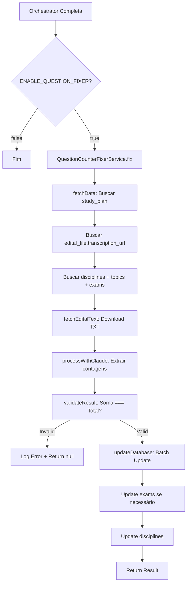

# Question Counter Fixer Service

## 📋 Visão Geral

Serviço **100% independente** criado para corrigir automaticamente contagens de questões por disciplina que o orchestrator falha em popular.

### Problema Identificado

Após execução do orchestrator, algumas disciplinas ficam com `number_of_questions = NULL` no banco de dados:

```sql
SELECT name, number_of_questions, 
       (SELECT COUNT(*) FROM topics WHERE discipline_id = disciplines.id) as topics_count
FROM disciplines 
WHERE plan_id = '4677832d-451c-49d2-b5a5-9176a76c5330';
```

**Resultado**:
- 22 disciplinas criadas
- 21 com `number_of_questions = NULL` ❌
- 1 com valor correto (12 questões) ✅

### Solução

Service que usa **Claude Sonnet 4** (temperature 0.1) para:
1. Baixar edital TXT original do Supabase Storage
2. Extrair contagem de questões por disciplina
3. Validar que soma === exam.total_questions
4. Atualizar banco de dados

---

## 🏗️ Arquitetura

### Localização

```
src/core/services/editais/
├── edital-process.service.ts   (existing - chamador)
└── question-counter-fixer.service.ts  (NEW - 520 linhas)
```

### Trigger

Executado **opcionalmente** após orchestrator completar:

```typescript
// edital-process.service.ts (linha ~1758)
if (process.env.ENABLE_QUESTION_FIXER === 'true') {
  const fixed = await questionCounterFixerService.fix(studyPlanId, userId);
}
```

### Variável de Ambiente

```bash
# .env
ENABLE_QUESTION_FIXER=true   # default: false
```

---

## 🧠 Lógica de Extração

### Prioridade (ordem)

1. **Direct Mention** (mais confiável)
   ```
   Edital: "Direito do Trabalho: 15 questões"
   → Atribui 15 questões diretamente
   ```

2. **Group Split** (grupos explícitos)
   ```
   Edital: "Bloco A (30 questões): Direito Civil, Direito Penal"
   → Distribui proporcionalmente dentro do grupo
   ```

3. **Proportional Split** (baseado em tópicos)
   ```
   Disciplinas com mais tópicos recebem mais questões
   Algoritmo garante soma exata
   ```

### Algoritmo Proportional Split

Quando edital **não especifica** contagens individuais:

```typescript
const base = Math.floor(totalQuestions / disciplinesCount);
const remainder = totalQuestions - (base * disciplinesCount);

// Top N disciplinas (mais tópicos) ganham +1 questão
// Demais ganham base
```

**Exemplo Real (OAB 44º)**:
- Total: 80 questões
- Disciplinas: 22
- Base: `floor(80/22) = 3`
- Sobra: `80 - (3×22) = 14`
- Top 14 disciplinas: 4 questões
- Outras 8: 3 questões
- **Soma: (14×4) + (8×3) = 80** ✅

---

## 🔄 Fluxo Completo



---

## 📊 Dados de Entrada/Saída

### Input (fetchData)

**Query Supabase**:
```typescript
study_plans → edital_id
edital_file → transcription_url
disciplines → id, name, number_of_questions, topics(count)
exams → exam_type, total_questions
```

**Exemplo Real**:
```json
{
  "transcriptionUrl": "https://...storage.../edital-oab-44.txt",
  "disciplines": [
    {
      "id": "uuid-1",
      "name": "Direito do Trabalho",
      "topics_count": 47,
      "current_questions": null
    },
    // ... 21 mais
  ],
  "exams": [
    { "exam_type": "objetiva", "total_questions": 80 },
    { "exam_type": "discursiva", "total_questions": 5 }
  ]
}
```

### Output (Claude Response)

```json
{
  "disciplines": [
    {
      "id": "uuid-1",
      "name": "Direito do Trabalho",
      "questions": 15,
      "reasoning": "Direct mention in section 3.2"
    }
  ],
  "validation": {
    "total_assigned": 80,
    "matches_exam": true
  },
  "exam_validation": {
    "type": "objetiva",
    "declared_total": 80,
    "is_correct": true
  }
}
```

### Return Value

```typescript
{
  disciplinesUpdated: 22,  // Número de disciplinas atualizadas
  examCorrected: false     // Se corrigiu exam.total_questions
}
```

---

## 🎯 Prompt Engineering

### Configuração Claude

```typescript
{
  model: 'claude-sonnet-4-5-20250929',
  temperature: 0.1,  // Baixa para precisão matemática
  max_tokens: 16000
}
```

### Estrutura do Prompt

```
You are an expert at analyzing Brazilian public examination notices...

EXAM INFORMATION:
- Total Questions: 80
- Exam Type: objetiva

DISCIPLINES (22 total):
1. Direito do Trabalho (47 topics)
2. Direito Civil (35 topics)
...

EXTRACTION PRIORITY:
1. Direct Mention
2. Group Split
3. Proportional Split

EDITAL TEXT:
[Full edital content]

OUTPUT FORMAT (JSON only):
{ "disciplines": [...], "validation": {...} }
```

### Por que English?

Claude Sonnet 4 interpreta melhor instruções complexas em inglês:
- Algoritmos matemáticos
- Lógica condicional (if/then)
- Estruturas de dados JSON

---

## ✅ Validação

### Checks Realizados

1. **Sum Validation**
   ```typescript
   sum(disciplines[].questions) === exam.total_questions
   ```

2. **Non-Zero Check**
   ```typescript
   disciplines[].questions > 0  // Todas disciplinas devem ter questões
   ```

3. **Result Structure**
   ```typescript
   result.disciplines.length === input.disciplines.length
   ```

### Falhas Possíveis

| Erro | Causa | Ação |
|------|-------|------|
| Sum mismatch | Claude errou cálculo | Log error + return null |
| Missing disciplines | Claude omitiu alguma | Log error + return null |
| Zero questions | Split incorreto | Log error + return null |

---

## 🛠️ Métodos Principais

### 1. `fix(studyPlanId, userId)`

**Método público** - Entry point do serviço

```typescript
async fix(studyPlanId: string, userId: string): Promise<FixResult | null>
```

**Retorno**:
```typescript
{
  disciplinesUpdated: number;
  examCorrected: boolean;
} | null
```

### 2. `fetchData(studyPlanId)`

Busca todos dados necessários:
- `transcription_url` via `study_plans.edital_id → edital_file`
- Disciplinas com contagem de tópicos (JOIN)
- Exames (objetiva + discursiva)

### 3. `fetchEditalText(transcriptionUrl)`

Download via `axios.get()`:
- Timeout: 30s
- ResponseType: 'text'
- Log: Tamanho em KB

### 4. `processWithClaude(...)`

Chama Claude API:
- Monta prompt com contexto completo
- Extrai JSON da resposta
- Valida estrutura

### 5. `validateResult(result, exams)`

Validações críticas:
- Soma === exam.total_questions
- Todas disciplinas presentes
- Nenhuma com 0 questões

### 6. `updateDatabase(studyPlanId, result)`

Atualiza banco:
- **Exams**: Apenas se `is_correct = false`
- **Disciplines**: Batch update (loop)

---

## 📝 Logs

### Identificador

```
[QUESTION-FIXER]
```

### Eventos Logados

```typescript
// Início
'🚀 Starting question correction'

// Data fetching
'📊 Data fetched'
'❌ Study plan not found'
'❌ Edital file not found'

// Download
'📥 Downloading edital text'
'✅ Edital text downloaded'

// Claude
'🤖 Calling Claude API'
'📝 Claude response received'
'✅ Claude result parsed'

// Validation
'🔍 Validating result'
'❌ Validation failed'

// Update
'📝 Updating exam total'
'📝 Updating disciplines'
'✅ All disciplines updated'

// Completion
'✅ Question correction completed'
```

---

## 🧪 Teste Manual

### 1. Ativar Feature

```bash
echo "ENABLE_QUESTION_FIXER=true" >> .env
```

### 2. Executar Processamento

```bash
curl -X POST http://localhost:3000/api/editais/process \
  -H "Content-Type: application/json" \
  -d '{
    "user_id": "your-user-id",
    "edital_file_id": "your-edital-id"
  }'
```

### 3. Verificar Logs

```bash
tail -f logs/combined.log | grep QUESTION-FIXER
```

### 4. Verificar Database

```sql
-- Antes
SELECT name, number_of_questions FROM disciplines 
WHERE plan_id = 'study-plan-id';
-- 21/22 com NULL

-- Depois
SELECT name, number_of_questions FROM disciplines 
WHERE plan_id = 'study-plan-id';
-- 22/22 com valores

-- Validação
SELECT SUM(number_of_questions) as total 
FROM disciplines 
WHERE plan_id = 'study-plan-id';
-- Deve bater com exams.total_questions
```

---

## 🚨 Tratamento de Erros

### Non-Blocking

Service é **não-crítico**. Falhas são logadas mas não param o fluxo:

```typescript
try {
  const fixed = await questionCounterFixerService.fix(...);
} catch (error) {
  logger.error('[EDITAL-BG] ⚠️  Question fixer failed (non-critical)', { error });
  // Continua execução normal
}
```

### Casos de Erro

| Erro | Return | Impacto |
|------|--------|---------|
| Supabase indisponível | `null` | Disciplinas mantêm NULL |
| Download TXT falha | `null` | Sem correção |
| Claude timeout | `null` | Retry manual necessário |
| Validação falha | `null` | Dados inconsistentes não salvos |

---

## 📈 Performance

### Métricas Esperadas

| Métrica | Valor | Observação |
|---------|-------|------------|
| Fetch Data | ~500ms | 4 queries Supabase |
| Download TXT | ~1-2s | Edital ~500KB |
| Claude Processing | ~10-30s | Depende do tamanho |
| Database Update | ~1s | 22 updates batch |
| **Total** | **~12-35s** | Execução completa |

### Custos Claude

**Tokens estimados**:
- Input: ~50K tokens (edital + prompt)
- Output: ~2K tokens (JSON)

**Custo por execução** (Sonnet 4):
- Input: $1.50/M tokens → ~$0.075
- Output: $7.50/M tokens → ~$0.015
- **Total: ~$0.09 por edital**

---

## 🔐 Segurança

### Service Role Key

Usa `SUPABASE_SERVICE_ROLE_KEY` para bypass RLS:
- ✅ Backend-only (não exposto)
- ✅ Acesso total ao database
- ✅ Necessário para updates batch

### Rate Limits

Claude API:
- Tier 1: 5 RPM (requests per minute)
- Tier 2: 50 RPM
- Service respeita limits naturalmente (1 call/edital)

---

## 🔄 Manutenção

### Quando Desativar

```bash
ENABLE_QUESTION_FIXER=false
```

**Cenários**:
- Orchestrator corrigido (popula questões corretamente)
- Custos Claude muito altos
- Teste/desenvolvimento local

### Quando Ativar

**Cenários**:
- Produção com editais reais
- Database com muitos NULL
- Após migração de dados

---

## 📚 Referências

- **Código**: `src/core/services/editais/question-counter-fixer.service.ts`
- **Integração**: `src/core/services/editais/edital-process.service.ts` (linha 1758)
- **Variável**: `.env.example` (linha 24)
- **Database**: `disciplines.number_of_questions`, `exams.total_questions`
- **Claude Model**: `claude-sonnet-4-5-20250929`
- **API Key**: `process.env.CLAUDE_AI_API_KEY`

---

## 🎯 Próximos Passos

1. ✅ **Implementação completa** - Código pronto
2. ⏳ **Teste com dados reais** - study_plan_id: `4677832d-451c-49d2-b5a5-9176a76c5330`
3. ⏳ **Ajuste de prompt** - Se necessário após testes
4. ⏳ **Monitoramento** - Logs de success/failure rate
5. ⏳ **Documentação** - Adicionar ao FLUXO-DEFINITIVO-E2E.md

---

**Data de Criação**: 2025-01-20  
**Autor**: Paulo Chaves + GitHub Copilot  
**Status**: ✅ Pronto para teste
