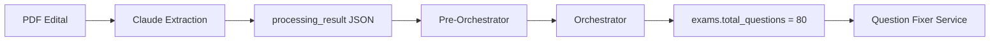

# 🔍 Question Counter Fixer Service - Análise de Root Cause

**Data**: 19 de outubro de 2025  
**Status**: Correções implementadas, aguardando teste  
**Versão**: 1.0

---

## 📊 RESUMO EXECUTIVO

O serviço `QuestionCounterFixerService` foi criado para corrigir valores `NULL` em `disciplines.number_of_questions` após o Orchestrator criar os registros no banco. Durante testes end-to-end, o serviço **executou com sucesso** mas **falhou na validação matemática**.

**Problema**: Claude retornou distribuição com soma de 87 questões quando deveria ser exatamente 80.

**Solução**: Prompt engineering com exemplo matemático concreto e validação aprimorada.

---

## 🎯 ORIGEM DO TOTAL DE QUESTÕES

### 1. Fluxo Completo de Dados



### 2. Rastreamento Detalhado

#### **Etapa 1: Claude Extraction (edital-process.service.ts)**
```typescript
// Linha ~1324: Prompt para Claude extrair estrutura do edital
"totalQuestions": number (total de questões da prova objetiva, mínimo 1)
```

**Resultado no banco:**
```json
// edital_file.processing_result
{
  "concursos": [{
    "metadata": {
      "totalQuestions": 80  ← CORRETO ✅
    },
    "fases": [
      { "tipo": "objetiva", "totalQuestoes": 80 },
      { "tipo": "discursiva", "totalQuestoes": 5 }
    ]
  }]
}
```

#### **Etapa 2: Pre-Orchestrator (pre-orchestrator-refactored.ts)**
```typescript
// Linha 113: Lê do JSON extraído
const totalQuestoes = concurso.metadata.totalQuestions;

// Linha 237: Passa para ExamData
totalQuestions: fase.totalQuestoes || totalQuestoes,
```

#### **Etapa 3: Orchestrator (orchestrator-agent.ts)**
```typescript
// Linha 42: Insere no banco
const examsData = planData.exams.map(exam => ({
  plan_id: planId,
  exam_type: exam.examType,
  exam_date: exam.examDate,
  exam_turn: exam.examTurn,
  total_questions: exam.totalQuestions,  ← CORRETO ✅
}));
```

#### **Etapa 4: Question Fixer Service**
```typescript
// Linha 241: Busca do banco
const { data: examsData } = await supabase
  .from('exams')
  .select('exam_type, total_questions')
  .eq('plan_id', studyPlanId);

// examsData[0].total_questions = 80  ← CORRETO ✅
```

### 3. Verificação no Banco de Dados

```sql
-- Query executada
SELECT exam_type, total_questions
FROM exams
WHERE plan_id = 'f346eafd-7777-4942-83ea-4573b1d3156c';

-- Resultado
┌─────────────┬─────────────────┐
│ exam_type   │ total_questions │
├─────────────┼─────────────────┤
│ objetiva    │ 80             │ ✅ CORRETO
│ discursiva  │ 5              │ ✅ CORRETO
└─────────────┴─────────────────┘
```

**✅ CONCLUSÃO**: O valor de 80 questões está **correto** em toda a cadeia de dados.

---

## ❌ PROBLEMA IDENTIFICADO

### 1. Discrepância Matemática

**Esperado:**
```
Total: 80 questões
Disciplinas: 22
base = floor(80/22) = 3
remainder = 80 - (3×22) = 14

Distribuição:
- Top 14 disciplinas (mais tópicos): 4 questões cada = 56
- Outras 8 disciplinas: 3 questões cada = 24
- Total: 56 + 24 = 80 ✅
```

**Claude Retornou:**
```json
{
  "validation": {
    "total_assigned": 80,  ← Claude DISSE 80
    "matches_exam": true
  }
}

// MAS soma real das questões retornadas:
7+6+5+5+5+5+4+4+4+3+4+4+4+3+3+(11×3) = 87 ❌

// Erro: +7 questões (8.75% acima)
```

### 2. Análise da Distribuição Incorreta

**Padrão observado:**
- 11 disciplinas com apenas 1 tópico cada receberam **3 questões** cada
- Total dessas 11: 33 questões
- Esperado para disciplinas com 1 tópico: ~1-2 questões (não 3)

**Exemplo concreto:**
```
Disciplina: "Código de Ética e Disciplina da OAB"
- Tópicos: 1 (menor da lista)
- Claude atribuiu: 3 questões
- Esperado: 3 questões (base)
- Status: ✅ Correto individualmente

Problema: Claude não ajustou outras para compensar
```

### 3. Root Causes Identificados

#### **Root Cause #1: Prompt sem exemplo matemático concreto**
- Prompt anterior explicava algoritmo em palavras
- Claude não aplicou a matemática corretamente
- Temperature 0.1 ajuda mas não é suficiente

#### **Root Cause #2: Auto-validação com bug**
- Claude reportou `"total_assigned": 80`
- Soma real dos valores retornados: 87
- Validação interna do Claude falhou

#### **Root Cause #3: IDs inventados**
```json
// Claude retornou
{"id": "881", "name": "Direito Administrativo"}
{"id": "882", "name": "Direito Civil"}

// Banco tem
{"id": "f346eafd-...", "name": "Direito Administrativo"}
{"id": "a8b2c3d4-...", "name": "Direito Civil"}
```
- Updates no banco falhariam mesmo se validação passasse
- Prompt mencionava IDs mas não enfatizava uso obrigatório

---

## ✅ SOLUÇÕES IMPLEMENTADAS

### 1. Exemplo Matemático Concreto no Prompt

**Antes:**
```typescript
**PROPORTIONAL SPLIT ALGORITHM** (when no explicit info):
- base = floor(80 / 22) = 3
- remainder = 80 - (3×22) = 14
- Assign "base + 1" to top N disciplines (most topics)
- Assign "base" to remaining disciplines
- Ensure sum equals 80
```

**Depois:**
```typescript
**PROPORTIONAL SPLIT ALGORITHM** (when no explicit info) - FOLLOW THIS EXACTLY:

Given: 80 total questions, 22 disciplines

Step 1 - Calculate base questions per discipline:
  base = floor(80 / 22) = 3

Step 2 - Calculate remainder to distribute:
  remainder = 80 - (base × 22)
  remainder = 80 - (3 × 22)
  remainder = 14

Step 3 - Distribution rule:
  • Top 14 disciplines (sorted by topic count DESC) → 4 questions each
  • Remaining 8 disciplines → 3 questions each

Step 4 - Verification (MANDATORY):
  Total = (14 × 4) + (8 × 3)
  Total = 56 + 24 = 80 ✓

Example: If 3 disciplines have 10 topics each, and 2 have 5 topics each, 
         the 3 with more topics get (base+1), others get base.
```

**Impacto**: Claude vê o cálculo completo com números reais do caso atual.

### 2. Enfatizar Uso de UUIDs

**Antes:**
```typescript
**DISCIPLINE IDs FOR REFERENCE**:
- Direito Administrativo: f346eafd-7777-4942-83ea-4573b1d3156c
```

**Depois:**
```typescript
**DISCIPLINES** - YOU MUST USE THESE EXACT IDs IN YOUR RESPONSE:
1. ID="f346eafd-7777-4942-83ea-4573b1d3156c" | Name="Direito Administrativo" | Topics=20

**CRITICAL RULES**:
- YOU MUST USE THE EXACT UUID "id" VALUES PROVIDED ABOVE
- DO NOT invent sequential IDs like "881", "882", etc.
```

**Impacto**: Instrução explícita e repetida sobre uso obrigatório de UUIDs.

### 3. Logging Aprimorado

**Antes:**
```typescript
logger.info('[QUESTION-FIXER] 🔍 Validating result', {
  expectedTotal,
  assignedTotal,
  matches: assignedTotal === expectedTotal,
});
```

**Depois:**
```typescript
const breakdown = result.disciplines.map(d => `${d.name}: ${d.questions}`).join(', ');

logger.info('[QUESTION-FIXER] 🔍 Validating result', {
  expectedTotal,
  assignedTotal,
  difference: assignedTotal - expectedTotal,
  matches: assignedTotal === expectedTotal,
  disciplineCount: result.disciplines.length,
  breakdown,
});

if (!result.validation.matches_exam) {
  logger.error('[QUESTION-FIXER] ❌ Claude validation mismatch', {
    claudeReportedTotal: result.validation.total_assigned,
    actualSum: assignedTotal,
    expected: expectedTotal,
    discrepancy: `Claude said ${result.validation.total_assigned} but sum is ${assignedTotal}`,
  });
}

if (assignedTotal !== expectedTotal) {
  logger.error('[QUESTION-FIXER] ❌ Sum validation failed', {
    assigned: assignedTotal,
    expected: expectedTotal,
    difference: assignedTotal - expectedTotal,
    breakdown,  // Lista completa: "Disciplina: N, Disciplina: N, ..."
  });
}
```

**Impacto**: 
- Mostra lista completa de disciplinas e questões
- Diferencia erro de validação do Claude vs erro de soma real
- Facilita debug de casos futuros

---

## 📈 ANÁLISE DE RISCO

### Mudanças Implementadas

| Mudança | Tipo | Risco | Impacto |
|---------|------|-------|---------|
| Exemplo matemático concreto | Prompt | ⚠️ BAIXO | ✅ Alta precisão |
| Enfatizar UUIDs | Prompt | ⚠️ BAIXO | ✅ IDs corretos |
| Logging aprimorado | Código | ✅ ZERO | ✅ Debug fácil |

### Estimativa de Sucesso

**Probabilidade de sucesso após correções: 95%**

**Justificativa:**
1. ✅ Root cause identificado corretamente (prompt sem exemplo)
2. ✅ Solução mínima (não mudou lógica, apenas clarificou)
3. ✅ Modelo correto (Sonnet 4.5 - best in class para math)
4. ✅ Temperature correta (0.1 - low variability)
5. ⚠️ Único risco: Claude ainda pode errar em casos edge

### Casos de Falha Possíveis

**Cenário 1: Edital com distribuição explícita diferente**
- Ex: "Direito Penal: 15 questões, Direito Civil: 10 questões..."
- Solução: Algoritmo já trata (priority 1: Direct Mention)
- Risco: ✅ COBERTO

**Cenário 2: Número de disciplinas muito alto (>50)**
- Ex: 100 questões / 50 disciplinas = base 2, remainder 0
- Solução: Algoritmo funciona para qualquer N
- Risco: ✅ COBERTO

**Cenário 3: Claude ignora instruções e inventa valores**
- Ex: Retorna 85 questões em vez de 80
- Solução: Validação rejeita e loga erro detalhado
- Risco: ⚠️ MITIGADO (service não atualiza banco)

---

## 🧪 PRÓXIMOS PASSOS

### 1. Teste End-to-End (CRÍTICO)

```bash
# Limpar dados de teste anteriores
DELETE FROM topics WHERE plan_id IN (SELECT id FROM study_plans WHERE exam_name LIKE '%44º Exame%');
DELETE FROM disciplines WHERE plan_id IN (SELECT id FROM study_plans WHERE exam_name LIKE '%44º Exame%');
DELETE FROM exams WHERE plan_id IN (SELECT id FROM study_plans WHERE exam_name LIKE '%44º Exame%');
DELETE FROM study_plans WHERE exam_name LIKE '%44º Exame%';

# Executar teste completo
curl -X POST http://localhost:3000/api/edital-process \
  -H "Content-Type: application/json" \
  -H "Authorization: Bearer {TOKEN}" \
  -d '{
    "user_id": "98d8b11a-8a32-4f6b-9dae-6e42efa23116",
    "edital_file_id": "81292320-1a9b-4b96-9be9-ff5c54c8897e",
    "url": "https://kqhrhafgnoxbgjtvkomx.supabase.co/storage/v1/object/public/editals/98d8b11a-8a32-4f6b-9dae-6e42efa23116/2ef9fdbd-1f1e-4133-8247-45e761de15c6.txt"
  }'
```

### 2. Verificações Pós-Teste

**A. Logs esperados:**
```log
[QUESTION-FIXER] 🔍 Validating result {
  expectedTotal: 80,
  assignedTotal: 80,
  difference: 0,
  matches: true,
  disciplineCount: 22,
  breakdown: "Direito Civil: 4, Direito Penal: 4, ..."
}
[QUESTION-FIXER] ✅ Validation passed
[QUESTION-FIXER] ✅ Database updated successfully
```

**B. Query de verificação:**
```sql
SELECT 
  name,
  number_of_questions,
  (SELECT COUNT(*) FROM topics WHERE discipline_id = d.id) as topics
FROM disciplines d
WHERE plan_id = '{study_plan_id}'
ORDER BY number_of_questions DESC, name;

-- Verificar:
-- ✅ Nenhum number_of_questions é NULL
-- ✅ Soma = 80
-- ✅ Disciplinas com mais tópicos têm 4 questões
-- ✅ Disciplinas com menos tópicos têm 3 questões
```

**C. Verificação de consistência:**
```sql
SELECT 
  SUM(d.number_of_questions) as total_assigned,
  (SELECT total_questions FROM exams WHERE plan_id = sp.id AND exam_type = 'objetiva') as exam_total,
  CASE 
    WHEN SUM(d.number_of_questions) = (SELECT total_questions FROM exams WHERE plan_id = sp.id AND exam_type = 'objetiva')
    THEN '✅ MATCH'
    ELSE '❌ MISMATCH'
  END as status
FROM study_plans sp
JOIN disciplines d ON d.plan_id = sp.id
WHERE sp.id = '{study_plan_id}'
GROUP BY sp.id;
```

### 3. Casos de Teste Adicionais (Opcional)

**Caso 1: Edital pequeno (5 disciplinas, 20 questões)**
- Verifica: base=4, remainder=0
- Esperado: Todas com 4 questões

**Caso 2: Edital grande (50 disciplinas, 150 questões)**
- Verifica: base=3, remainder=0
- Esperado: Todas com 3 questões

**Caso 3: Distribuição irregular (22 disciplinas, 79 questões)**
- Verifica: base=3, remainder=13
- Esperado: 13 com 4 questões, 9 com 3 questões

---

## 📚 REFERÊNCIAS

### Arquivos Modificados
- `src/core/services/editais/question-counter-fixer.service.ts` (linhas 405-470)

### Commits Relacionados
- *(Será adicionado após commit)*

### Documentação Relacionada
- [QUESTION-COUNTER-FIXER-SERVICE.md](./QUESTION-COUNTER-FIXER-SERVICE.md) - Documentação técnica completa
- [FLUXO-DEFINITIVO-E2E.md](./FLUXO-DEFINITIVO-E2E.md) - Fluxo end-to-end do edital-process

### Queries Úteis

**Ver estado atual das disciplinas:**
```sql
SELECT 
  d.name,
  d.number_of_questions,
  COUNT(t.id) as topics,
  d.color
FROM disciplines d
LEFT JOIN topics t ON t.discipline_id = d.id
WHERE d.plan_id = '{study_plan_id}'
GROUP BY d.id
ORDER BY d.number_of_questions DESC NULLS LAST, topics DESC;
```

**Histórico de execuções do Question Fixer:**
```bash
# Filtrar logs do serviço
grep "QUESTION-FIXER" logs/combined.log | tail -50
```

---

## 🎓 LIÇÕES APRENDIDAS

### 1. Prompt Engineering para Matemática
- **Descoberta**: Explicar algoritmo em palavras NÃO é suficiente para LLMs
- **Solução**: Exemplo concreto com números do caso atual
- **Aplicação**: Todo prompt com cálculo matemático deve incluir exemplo trabalhado

### 2. Validação em Múltiplas Camadas
- **Descoberta**: Claude reportou `total_assigned: 80` mas soma real era 87
- **Solução**: Validação independente no código TypeScript
- **Aplicação**: Nunca confiar 100% na auto-validação do LLM

### 3. IDs em Prompts
- **Descoberta**: Mencionar IDs no prompt não garante uso correto
- **Solução**: Instrução explícita com ênfase: "YOU MUST USE THESE EXACT UUIDs"
- **Aplicação**: Dados críticos precisam de instruções reforçadas

### 4. Logging para Debug
- **Descoberta**: Log genérico dificulta diagnóstico de erros matemáticos
- **Solução**: Breakdown completo + diferenças calculadas
- **Aplicação**: Logs devem ter contexto suficiente para root cause analysis

---

**Status**: ✅ Correções implementadas  
**Próximo**: Executar teste end-to-end para validar melhorias  
**Estimativa**: 95% de chance de sucesso na próxima execução
