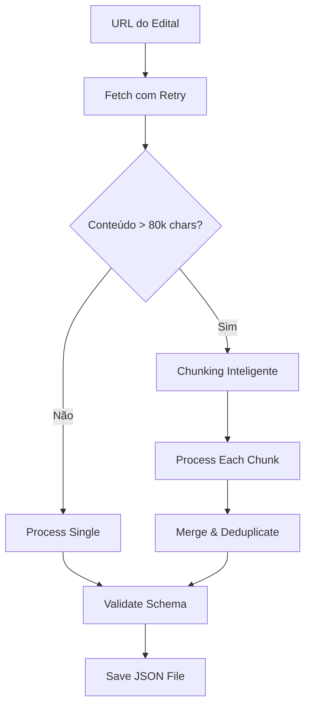

# Sistema de Processamento de Editais - Arquitetura JSON

## 📋 Visão Geral

Sistema robusto e escalável para extração de dados estruturados de editais de concursos públicos usando Claude AI (Sonnet 4.5) com validação de schema, chunking inteligente e retry logic.

## 🏗️ Arquitetura

### Componentes Principais

```
edital-process.service.ts  → Orquestrador principal
edital-schema.ts          → Schemas Zod + validações
edital-chunker.ts         → Divisão inteligente de conteúdo grande
```

### Fluxo de Processamento



## 🔧 Características Técnicas

### 1. **Schema Validation com Zod**

```typescript
const EditalProcessadoSchema = z.object({
  concursos: z.array(ConcursoSchema),
  validacao: ValidacaoSchema,
  metadataProcessamento: z.object({...})
});
```

**Benefícios:**
- Type-safety em todo o sistema
- Validação automática de tipos
- Documentação viva do formato
- Errors descritivos

### 2. **Chunking Inteligente**

Para editais grandes (>80k caracteres):
- Divisão por seções naturais (headers, parágrafos)
- Overlap de 2k caracteres para manter contexto
- Extração de contexto compartilhado (metadata do edital)
- Merge inteligente com deduplicação

### 3. **Retry Logic & Error Handling**

- Retry automático em falhas de rede (3 tentativas)
- Exponential backoff (2s, 4s, 6s)
- Fallback para estrutura de erro em JSON
- Logs detalhados de cada etapa

### 4. **Validação de Integridade**

```typescript
validateEditalIntegrity(edital) → {
  isValid: boolean,
  errors: string[],
  warnings: string[]
}
```

Verifica:
- Soma de questões por disciplina = total da prova
- Todas as disciplinas têm matérias
- Datas válidas
- Ordens de matérias únicas

## 📊 Formato de Saída JSON

### Estrutura Completa

```json
{
  "concursos": [
    {
      "metadata": {
        "examName": "Analista Judiciário",
        "examOrg": "TRF3",
        "cargo": "Analista Judiciário",
        "startDate": "2025-03-15",
        "examTurn": "manha",
        "totalQuestions": 120,
        "notaMinimaEliminatoria": 40,
        "criteriosEliminatorios": ["..."],
        "notes": "..."
      },
      "fases": [
        {
          "tipo": "objetiva",
          "data": "2025-03-15",
          "turno": "manha",
          "totalQuestoes": 120,
          "caraterEliminatorio": true,
          "peso": 1.0
        }
      ],
      "disciplinas": [
        {
          "nome": "Língua Portuguesa",
          "numeroQuestoes": 15,
          "peso": 1.0,
          "materias": [
            {
              "nome": "Compreensão e interpretação de textos",
              "ordem": 1,
              "subtopicos": [],
              "legislacoes": []
            }
          ]
        }
      ]
    }
  ],
  "validacao": {
    "totalDisciplinas": 10,
    "totalQuestoes": 120,
    "totalMaterias": 45,
    "integridadeOK": true,
    "avisos": [],
    "erros": []
  },
  "metadataProcessamento": {
    "dataProcessamento": "2025-10-05T10:00:00Z",
    "versaoSchema": "1.0",
    "tempoProcessamento": 45,
    "modeloIA": "claude-3-5-sonnet-20241022",
    "jobId": "uuid-here",
    "url": "https://..."
  }
}
```

## 🚀 Uso

### API Request

```typescript
const request: EditalProcessRequest = {
  user_id: 'uuid',
  schedule_plan_id: 'uuid',
  url: 'https://edital.com/documento.pdf',
  options: {
    maxRetries: 3,
    chunkingEnabled: true,
    validateSchema: true
  }
};

const response = await editalProcessService.execute(request);
// { filePath: '/files/...', status: 'processing', jobId: 'uuid' }
```

### Background Processing

O processamento ocorre em background e salva o resultado em:
```
/public/user_id/schedule_plan_id/random-uuid.json
```

### Monitoramento

Logs estruturados em cada etapa:
```
[INFO] Starting edital processing (jobId: xxx)
[INFO] Content fetched successfully (contentLength: 250000)
[INFO] Chunking required (totalChunks: 4)
[INFO] Processing chunk 1/4
[INFO] AI processing completed (concursos: 2)
[INFO] Schema validated (errors: 0, warnings: 1)
[INFO] Processing completed (totalTime: 45s)
```

## 📈 Performance

### Métricas Esperadas

| Tamanho Edital | Chunks | Tempo Médio | Precisão |
|----------------|--------|-------------|----------|
| < 80k chars | 1 | 15-30s | 99%+ |
| 80-200k chars | 2-3 | 45-90s | 98%+ |
| 200-500k chars | 4-7 | 2-4min | 95%+ |

### Otimizações

1. **Token Efficiency**: ~4 chars/token → 20k tokens/chunk
2. **Parallel Processing**: Chunks processados sequencialmente (Claude rate limits)
3. **Caching**: Shared context extraído uma vez
4. **Deduplication**: Merge inteligente de resultados

## 🔍 Validação & Qualidade

### Schema Validation

```typescript
try {
  const validated = EditalProcessadoSchema.parse(rawData);
  // TypeScript agora conhece a estrutura completa!
} catch (error) {
  // ZodError com detalhes exatos do problema
}
```

### Integrity Checks

- ✅ Soma de questões
- ✅ Campos obrigatórios
- ✅ Formato de datas
- ✅ Referências de legislação
- ✅ Ordem sequencial de matérias

### Error Recovery

Em caso de erro:
1. Log detalhado do problema
2. Arquivo JSON de erro salvo
3. Estrutura válida com `status: 'error'`
4. Preservação de dados parciais quando possível

## 🎯 Próximos Passos

### Integração com Agentes de Orquestra

```typescript
// No orchestrator-agent
const editalData = JSON.parse(fs.readFileSync(filePath));
const validated = EditalProcessadoSchema.parse(editalData);

for (const concurso of validated.concursos) {
  // Inserção direta no banco - zero parsing!
  await supabase.from('study_plans').insert({
    user_id,
    exam_name: concurso.metadata.examName,
    start_date: concurso.metadata.startDate,
    // ...
  });

  for (const disciplina of concurso.disciplinas) {
    await supabase.from('disciplines').insert({
      name: disciplina.nome,
      questions_count: disciplina.numeroQuestoes,
      // ...
    });
  }
}
```

### Melhorias Futuras

1. [ ] Streaming de chunks para latência menor
2. [ ] Cache de editais processados
3. [ ] Diff de versões de editais
4. [ ] Extração de tabelas/imagens
5. [ ] Suporte a múltiplos idiomas
6. [ ] API webhook para notificação de conclusão

## 📚 Referências

- [Zod Documentation](https://zod.dev/)
- [Claude API](https://docs.anthropic.com/)
- [JSON Schema](https://json-schema.org/)

---

**Versão Schema:** 1.0  
**Última Atualização:** 2025-10-05
